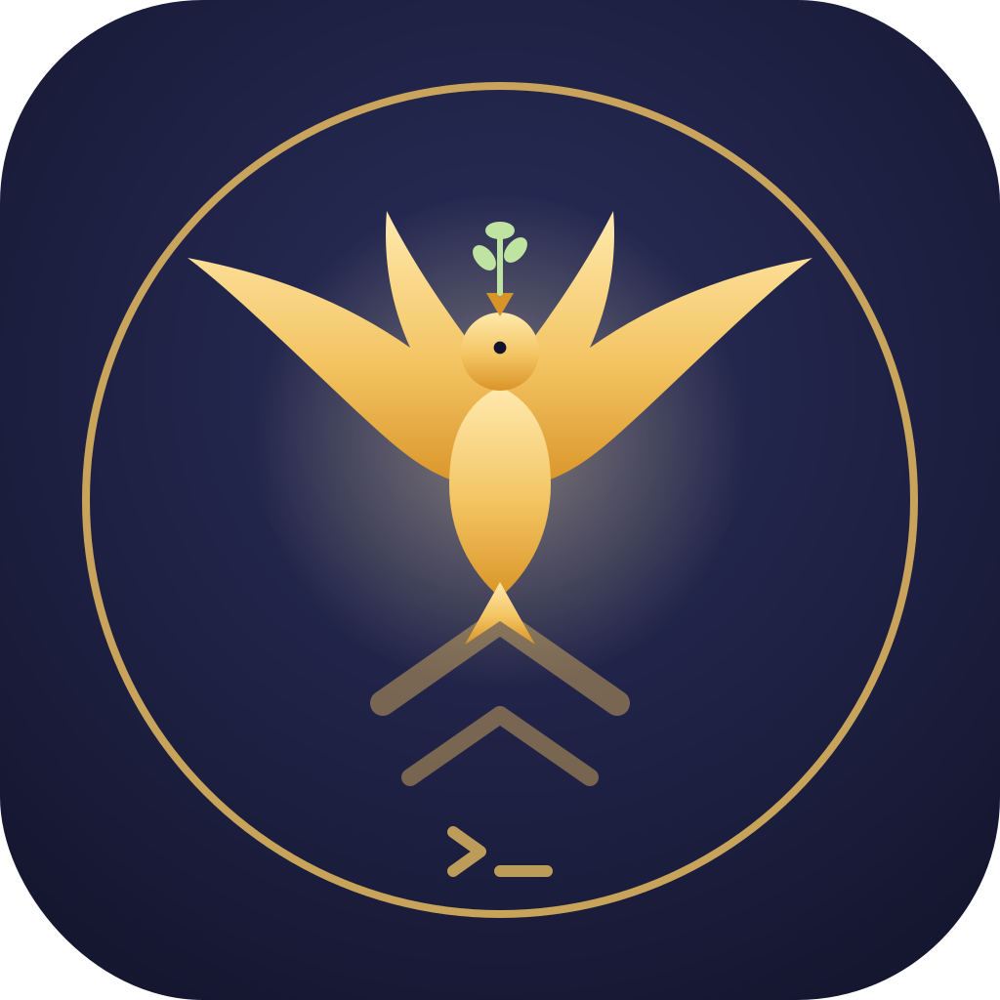

<div align="center">
  

  # Habemus Deploy — Rome Call Blessing Hook

  *A non-blocking pre-deploy benediction for Claude Code: it journals what ships, surfaces prod-vs-preview, and (opt-in) prays a Padre Nuestro over your releases.*
</div>

---

> **What this is.** An independent, **unofficial** open-source Claude Code hook offered as a respectful tribute to the Vatican's multi-year body of work on AI ethics — the **Rome Call for AI Ethics** (2020), the doctrinal Note **_Antiqua et Nova_** (2025), and Pope Leo XIV's first encyclical **_Magnifica humanitas_** (2026).
>
> **What this is NOT.** It is **not** an official Anthropic–Vatican partnership, **not** a Rome Call signatory artifact, and **not** endorsed by the Holy See, the Pontifical Academy for Life, the RenAIssance Foundation, or Anthropic. See [Honest framing](#honest-framing) and [`NOTICE`](NOTICE).

## Why a deploy blessing?

A deploy is the moment code leaves your hands and touches the world. Faith traditions have always marked thresholds with a pause and a blessing. The Vatican's recent AI-ethics work frames technology as something to be stewarded toward human dignity, not rushed heedlessly — *Magnifica humanitas* (2026) calls for **robust oversight** and a pause before **irreversible** machine actions. A production deploy is exactly such a threshold.

So this hook does the small, serious thing: at the instant your agent is about to ship, it **stops for one beat** — records what is shipping, names whether it is production, and (if you opt in) offers a Padre Nuestro. The ritual rides on tooling you actually want (a deploy journal + prod-vs-preview surfacing), so it earns its place instead of being decoration.

It **never blocks, denies, delays, gates, or auto-approves a deploy.**

## What it does

When your Claude Code agent is about to run a deploy command (`vercel --prod`, `git push origin main`, `docker compose up`, `kubectl apply`, `terraform apply`, `fly deploy`, `gh release create`, `npm run deploy`, and more), the hook:

1. **Surfaces the environment** — classifies the command as **prod** or **preview**, so the blessing only fires on real production and previews stay quiet (no crying wolf).
2. **Appends a deploy-journal line** — `timestamp · env · command · git short-sha · branch · cwd` to `.claude/deploy-journal.log`, a grep-able "what shipped, when, from which commit" trail. Journal write errors are swallowed so they can never affect the deploy.
3. **Offers a mindful pause** — a one-line summary always, plus an optional gentle "deploying on a Friday / late at night — are you sure?" nudge.
4. **Prays (opt-in)** — if `PRAYER_ENABLED=true`, renders the Padre Nuestro / Pater Noster / Our Father over production deploys, in your chosen language, from a **swappable** text file.

## How it stays non-blocking (by construction)

This is a `PreToolUse` hook matched on the `Bash` tool. On a deploy match it **exits 0** and emits only a `{"systemMessage": "..."}` object — the one field that surfaces a user-visible message without altering control flow. For non-deploy commands it exits 0 with no output.

It **never** uses any blocking or flow-altering path: never `exit 2`, never `permissionDecision: deny`/`ask`, never `continue: false`, and — deliberately — **never `permissionDecision: allow`** either, because `allow` would skip your normal deploy confirmation and auto-run the command. We keep your usual permission flow intact; we only add a blessing. Every failure path is `exit 0` with no output.

> Caveat (from the Claude Code hooks docs): if you run a *separate* deny hook or a settings `deny` rule, that can still block a deploy independently — "most restrictive wins." This hook can never be the thing that hard-stops your deploy, but it also can't loosen someone else's block.

## Install

```bash
# 1. Get the files (clone, submodule, or copy hooks/ + prayers/ into your repo)
git clone https://github.com/<you>/habemus-deploy
cp -r habemus-deploy/hooks habemus-deploy/prayers your-project/

# 2. Make the hook executable
chmod +x your-project/hooks/bless-deploy.sh

# 3. Wire it in .claude/settings.json (project) or ~/.claude/settings.json (all projects)
```

```json
{
  "hooks": {
    "PreToolUse": [
      { "matcher": "Bash", "hooks": [
        { "type": "command", "command": "\"$CLAUDE_PROJECT_DIR\"/hooks/bless-deploy.sh" }
      ]}
    ]
  }
}
```

Requires `jq` (used to parse and safely encode JSON). Without `jq`, the hook degrades to a harmless no-op. See [`.claude/settings.json`](.claude/settings.json) for a copy-paste example.

## Configuration (all via environment variables)

| Variable | Default | Effect |
|---|---|---|
| `HABEMUS_DEPLOY_DISABLE` | unset | `1` = global kill switch; hook becomes a total no-op. |
| `PRAYER_ENABLED` | `false` | **Disabled by default.** `true` renders the prayer (journal + summary still work when off). |
| `PRAYER_LANG` | `la` | `la` Pater Noster · `es` Padre Nuestro · `en` Our Father. |
| `HABEMUS_DEPLOY_PROD_ONLY` | `true` | `false` also blesses preview deploys. |
| `HABEMUS_DEPLOY_PRAYER_FILE` | — | Absolute path to a custom prayer/quote file — swap in any text, or another tradition, or a secular line. |
| `HABEMUS_DEPLOY_JOURNAL` | `.claude/deploy-journal.log` | Journal path; set to `/dev/null` to disable journaling. |
| `HABEMUS_DEPLOY_SILENT` | unset | `1` = journal-only mode; no user-visible message. |
| `HABEMUS_DEPLOY_FRIDAY_NUDGE` | `true` | Toggle the Friday / late-night gentle reminder. Never blocks. |

## Test

```bash
bash test/test-hook.sh
```

Asserts the hook always exits 0, detects deploys, classifies prod vs preview, journals, renders the opt-in prayer only when enabled, and never emits a `permissionDecision`.

## Honest framing

As of **2026-05-28**, research for this project found a **real but limited, event-based** Anthropic–Vatican connection — **not** a formal union and **not** Rome Call signatory status:

- The **Rome Call for AI Ethics** was signed in Rome on **28 Feb 2020**, promoted by the Pontifical Academy for Life; original signatories were the Pontifical Academy for Life, Microsoft, IBM, the UN's FAO, and Italy's Ministry of Innovation. Its six principles: transparency, inclusion, accountability, impartiality, reliability, and security & privacy. ([romecall.org/the-call](https://www.romecall.org/the-call/))
- ***Antiqua et Nova***, a doctrinal Note on AI and human intelligence, was co-issued by the Dicastery for the Doctrine of the Faith and the Dicastery for Culture and Education, approved **14 Jan 2025**, published **28 Jan 2025**. ([vatican.va](https://www.vatican.va/roman_curia/congregations/cfaith/documents/rc_ddf_doc_20250128_antiqua-et-nova_en.html))
- **Pope Leo XIV** (Robert Francis Prevost), elected **8 May 2025**, issued his first encyclical ***Magnifica humanitas*** on AI and the human person (signed **15 May 2026**, presented **25 May 2026**), calling for robust regulation, independent oversight, and a ban on autonomous lethal/irreversible AI decisions. ([CNN](https://www.cnn.com/2025/05/08/europe/new-pope-conclave-white-smoke-vatican-intl); [vatican.va](https://www.vatican.va/content/leo-xiv/en/encyclicals/documents/20260515-magnifica-humanitas.html))
- **Anthropic** co-founder Chris Olah delivered remarks at the **25 May 2026** Vatican presentation of *Magnifica humanitas*, and Anthropic has held faith/cultural dialogues and consulted Catholic thinkers (incl. Bishop Paul Tighe) for its Claude Constitution work. **Anthropic is NOT a signatory of the Rome Call**; its corporate signatories remain Microsoft, IBM, Cisco, Salesforce, etc. ([anthropic.com](https://www.anthropic.com/news/chris-olah-pope-leo-encyclical))

So this project is an **independent, unofficial tribute** to that dialogue, not a claim of partnership. It serves users of **all faiths and none**: the prayer is **disabled by default**, stored as **swappable data**, and including or running this hook is **never a condition of use**.

*Sources gathered via live web research on 2026-05-28; some outlets (Vatican News, NCR, Religion News Service) returned HTTP 403 to automated fetch and were corroborated via search summaries — see the project's research notes. Verify time-sensitive claims against the primary sources.*

## License

[Apache-2.0](LICENSE) for the code. The included prayer texts are **public-domain** liturgical works; see [`NOTICE`](NOTICE).
